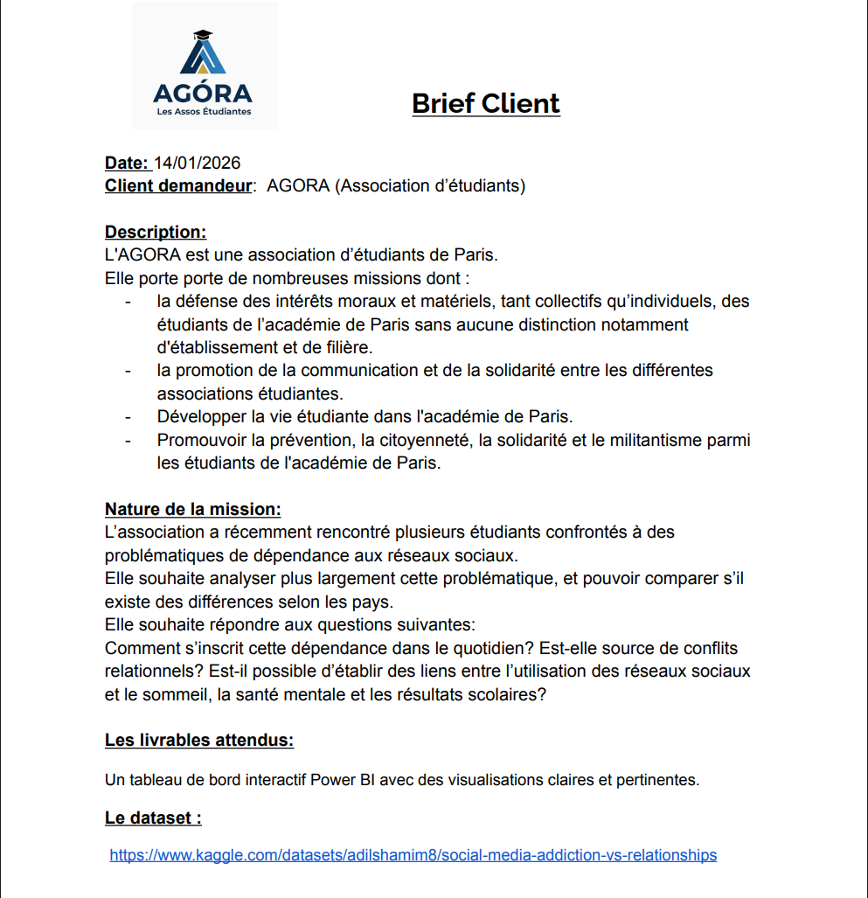
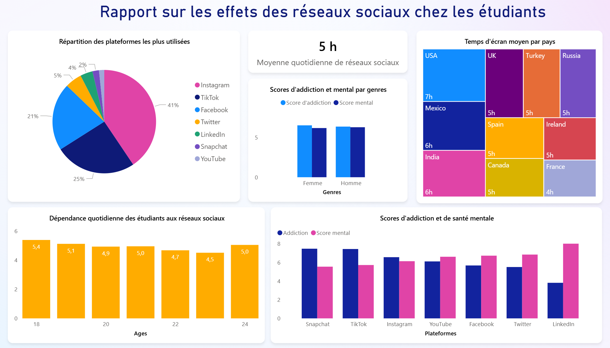
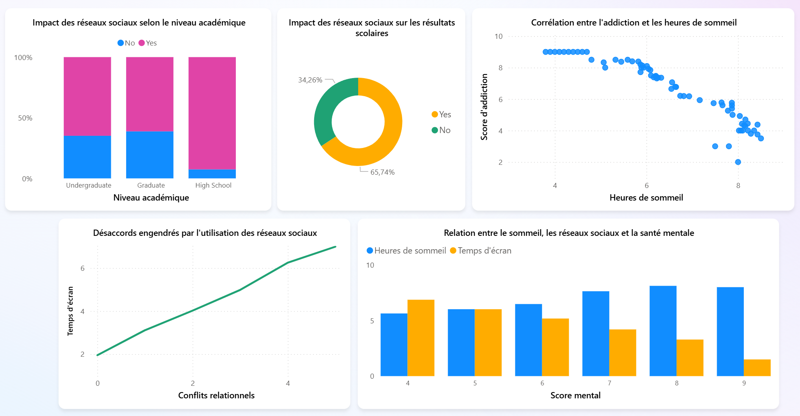

# 📱 Mission DATA - Analyse de la dépendance aux réseaux sociaux chez les étudiants

## 📌 Contexte

Les Missions DATA sont une nouvelle méthodologie d’apprentissage, ciblée sur les besoins métiers, qui a été testée et validée par des promos Data Analyst. 
Cette méthodologie concentre jeu de rôle, analyse de données et relation client. 

## 🧭 Les étapes préliminaires

1 - Chaque élève choisit **un dataset en fonction de son centre d’intérêt** (sur Kaggle, Data.gouv.fr ou autre)

*Le dataset doit être suffisamment complexe pour permettre une étude complète, mais ne pas nécessiter de nettoyage trop complexe vu le temps dédié.*

2 - Une fois le dataset validé par le formateur, chaque élève doit rédiger un **Brief Client.** Celui-ci doit comporter, en plus du lien vers le dataset:
- a. Le nom et la description du client fictif
- b. La nature de la mission data 
- c. Les livrables attendus

3 - Une fois les Briefs Clients validés par le formateur, celui-ci programme une journée **Mission Data**.

*Le formateur peut créer des groupes de deux (Team Data) et choisir la moitié de la classe qui sera aussi Client*

## 🧩 Objectifs & Enjeux

## Dashboards KPI

## 🛠️ Outils Utilisés  
- **Base de données** : Kaggle
- **Langage** : DAX
- **Visualisation** : Power BI

## ⭐ Projet réalisé par :
- Mourad B.
- Johane D.
